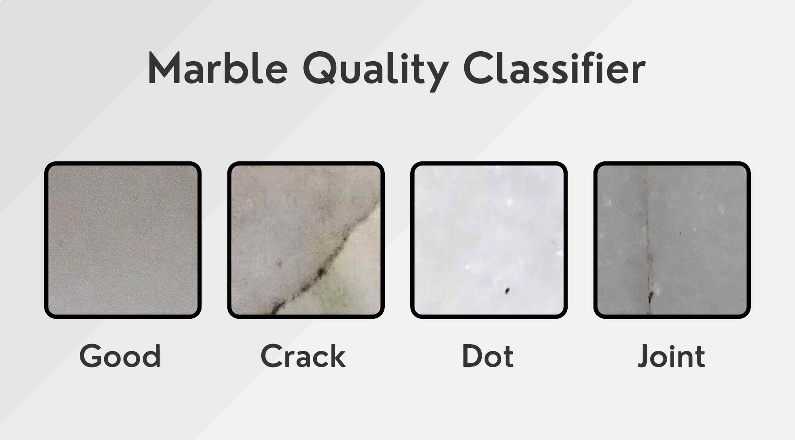

<h1>Marble Quality Classifier</h1>

 

A marble quality classifier using from scratch implementation of ResNet34, pretrained ResNet50, and Huggingface pretrained ViT transformer.

<h3>Built With</h3>

+ [Python](https://www.python.org/downloads/)
+ [HuggingFace Transformers](https://huggingface.co/docs/transformers/en/index)
  
<h3>About the Dataset</h3>

The [Dataset](https://www.kaggle.com/datasets/wardaddy24/marble-surface-anomaly-detection-2/data) contains 4 classes: crack, dot, good and joint. However, due to the small amount of data in each class I've decided to classify it into ['defective', 'good'] classes.
There are a total of 2249 files in the train folder and 688 files in the test folder.

### Results (Test Set Evaluation)

| Metric     | ResNet-34            | ResNet-50            | ViT                 |
|------------|-----------------------|----------------------|---------------------|
| Loss       | 0.512686409229456    | 0.4757918660030809   | 0.05209880151114492 |
| Accuracy   | 0.7543604651162791   | 0.8401162790697675   | 0.9869186046511628  |
| Precision  | 0.7561596608248294   | 0.8432938295655938   | 0.9869231618881927  |
| Recall     | 0.7543604651162791   | 0.8401162790697675   | 0.9869186046511628  |
| F1 Score   | 0.7540940431066183   | 0.8396321322580104   | 0.9869187981240866  |
| AUC        | 0.7547836375929683   | 0.8395199459093982   | 0.9869337390128465  |

### Contact Me

[Linkedin](https://www.linkedin.com/in/dahshory/)

### Acknowledgements

Thanks to [Samir Gouda](github.com/SamirGouda) & [Omar Eldahshoury](github.com/omareldahshoury) for thier support.
